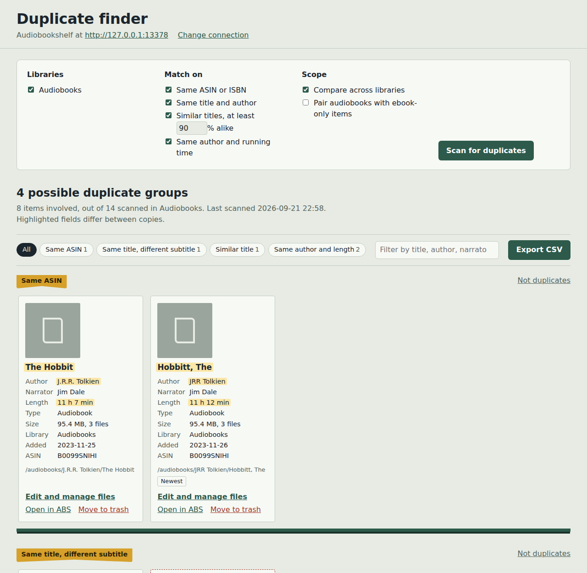
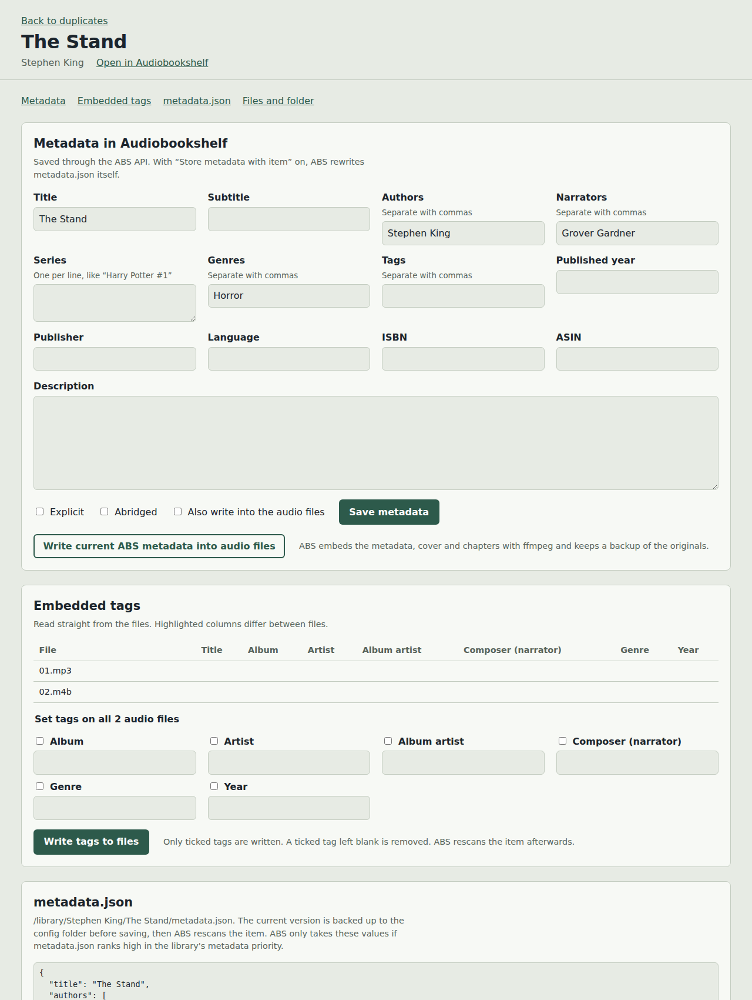
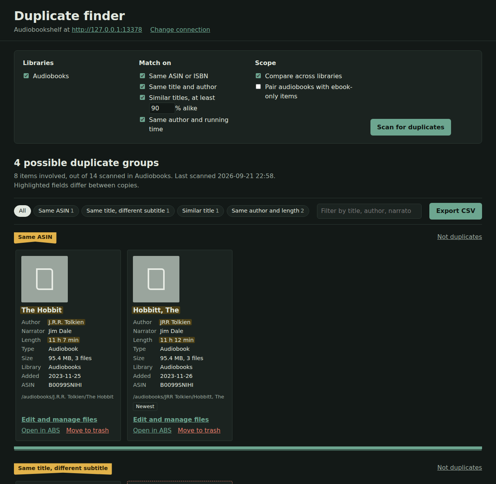
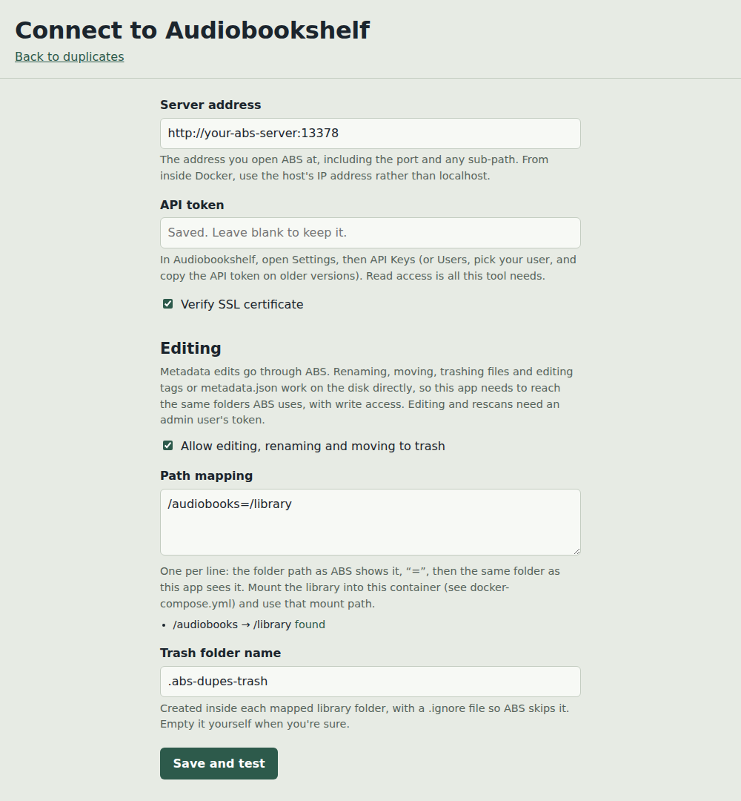

# ABS Duplicate Finder

Find, compare and clean up duplicate audiobooks in [Audiobookshelf](https://www.audiobookshelf.org/).

It scans your ABS book libraries through the API, groups likely duplicates, and shows the
copies side by side with the fields that differ highlighted. From any item you can edit its
ABS metadata, its embedded audio tags and its `metadata.json`, and rename, move or trash its
files and folder.

One Python file. Runs the same way on Windows (double-click) and in Docker.



## Features

**Finding duplicates**
- Match on ASIN or ISBN; same title and author after normalising (accents, "The",
  "(Unabridged)", `J.R.R.` vs `J. R. R.`); same title with a different subtitle; similar
  titles by the same author; same author and running time
- Titles with different numbers ("Book 1" vs "Book 2") or series positions are never paired
- Compare across libraries, and optionally pair audiobooks with ebook-only items
- Tags each copy as Largest, Newest or Missing on disk to help you pick a keeper
- Filter by match type, search, dismiss false positives, export to CSV

**Editing** (off by default)
- ABS metadata: title, authors, narrators, series, genres, tags, year, ASIN, ISBN, description
- Write metadata, cover and chapters into the audio files with ABS's own embed tool
- View embedded tags per file and bulk-set them directly (mp3, m4b, flac, ogg)
- Edit `metadata.json` with validation and automatic backups
- Rename and move folders, rename files, move files or whole items to trash



It follows your system's light or dark setting.



## Quick start

### Windows
1. Install [Python 3.9+](https://www.python.org/downloads/) (tick "Add Python to PATH").
2. Run `install_windows.bat` once.
3. Double-click `abs_dupes.pyw`. Your browser opens at http://127.0.0.1:5057.

Settings are saved next to the script.

### Docker

Using Portainer? See [docs/PORTAINER.md](docs/PORTAINER.md) for step-by-step instructions
and a ready-to-paste stack file.
```bash
git clone https://github.com/gmwestrup/abs-duplicate-finder.git
cd abs-duplicate-finder
# edit docker-compose.yml: library mount, ABS_URL, PATH_MAP
docker compose up -d --build        # older installs: sudo docker-compose up -d --build
```
Open http://your-server:5057. Settings live in `./config`.

A multi-arch image (amd64 and arm64) is also built by GitHub Actions and published to
`ghcr.io/gmwestrup/abs-duplicate-finder:latest`. See the comments in
`docker-compose.yml` to use it instead of building locally.

## Connecting

| Setting | What to enter |
|---|---|
| Server address | The URL you open ABS at, including port and any sub-path. From Docker, use the host's IP, not `localhost`. |
| API token | ABS → Settings → API Keys (or Users → your user on older versions). Use an **admin** user if you want to edit. |
| Path mapping | Only for file editing. One per line: `<folder as ABS shows it>=<same folder as this app sees it>` |

Path mapping examples:

```
/audiobooks=/library                     # Docker, with the library mounted at /library
/audiobooks=Z:\Audiobooks                # Windows, mapped drive
/audiobooks=\\server\share\Audiobooks     # Windows, network path
```



The settings page shows whether each mapped folder can be found.

## How edits are applied

| Edit | Method | Afterwards |
|---|---|---|
| Metadata | ABS API | ABS updates its database, and rewrites `metadata.json` if "Store metadata with item" is on |
| Embed into audio files | ABS embed tool (ffmpeg) | ABS keeps backups of the originals |
| Embedded tags, direct | mutagen, on every audio file in the item | Item rescan |
| `metadata.json` | Written after a JSON check; previous copy saved to `backups/` | Item rescan |
| Rename or move folder | On disk, inside the mapped folder only | Library rescan |
| Rename or trash a file | On disk | Item rescan |
| Trash whole item | Folder moved to trash, item removed from ABS | Removed from the duplicate list |

## Safety

- Scanning is read-only. Editing stays off until you turn it on in settings.
- Nothing is deleted. Trash is a folder (default `.abs-dupes-trash`) in the library root
  containing a `.ignore` file so ABS skips it. Empty it yourself when you're sure.
- Every path is checked to stay inside the mapped library folder. Names containing `/`,
  `..` or characters Windows can't use are refused.
- Every change is written as one JSON line to `abs_dupes_changes.log`.
- Editing forms carry a per-run token, so other web pages can't trigger changes.
- Your API token is stored in `abs_dupes_settings.json`, which `.gitignore` excludes.

Try it on a test item before a big cleanup, and keep backups of your library.

## Configuration reference

| Environment variable | Default | Purpose |
|---|---|---|
| `ABS_URL` | | Pre-fills the server address |
| `ABS_TOKEN` | | Pre-fills the API token |
| `ABS_VERIFY_SSL` | `1` | Set `0` for self-signed certificates |
| `ABS_EDITING` | `0` | Set `1` to allow editing |
| `PATH_MAP` | | Path mappings, separated by `;` |
| `TRASH_DIR` | `.abs-dupes-trash` | Trash folder name inside each library root |
| `PORT` | `5057` | Web port |

Values saved in the web UI take priority over environment variables.

## Files it creates

| File | Contents |
|---|---|
| `abs_dupes_settings.json` | Connection and editing settings, including your token |
| `abs_dupes_last_scan.json` | The last scan's results |
| `abs_dupes_dismissed.json` | Groups marked "Not duplicates" |
| `abs_dupes_changes.log` | One line per change made |
| `backups/` | Previous versions of edited `metadata.json` files |

On Windows these sit next to the script; in Docker they're in `/config`.

## License

MIT. See [LICENSE](LICENSE).
